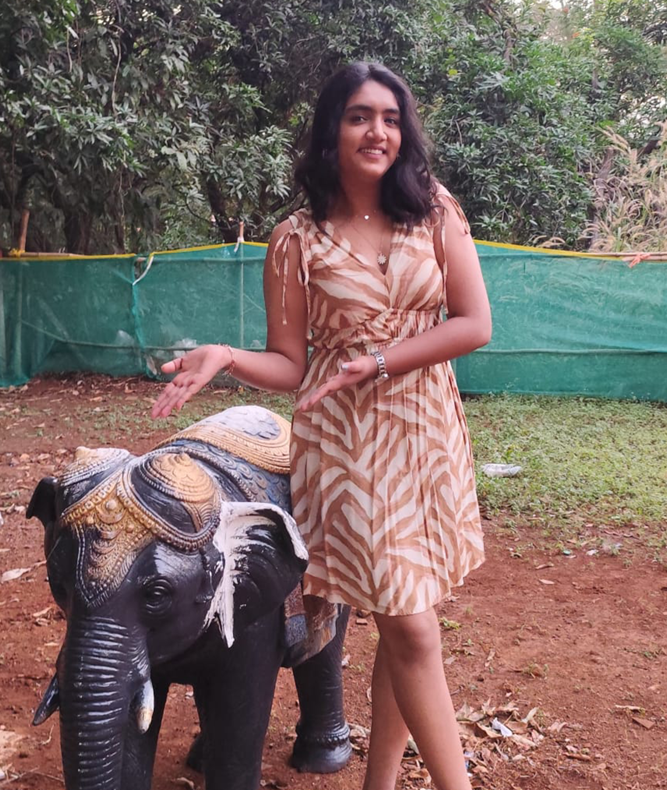
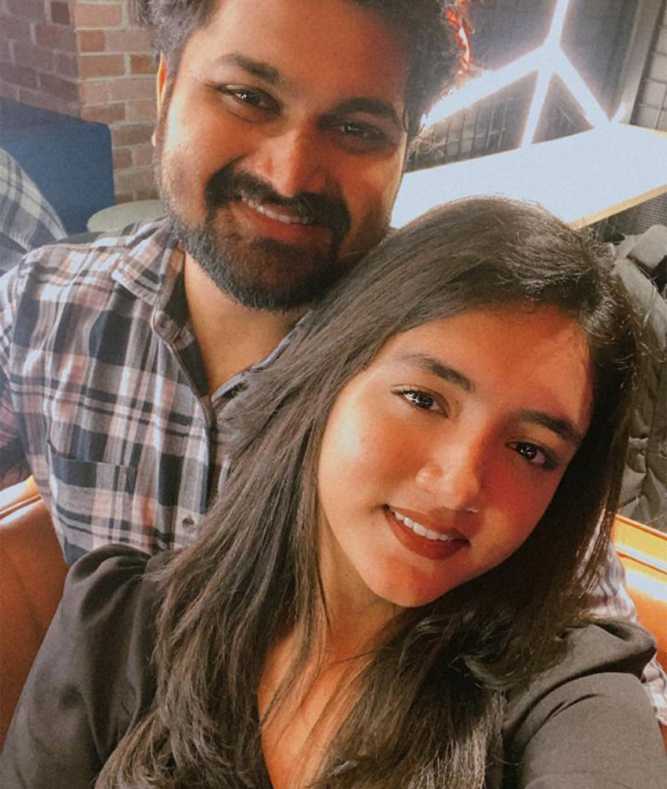
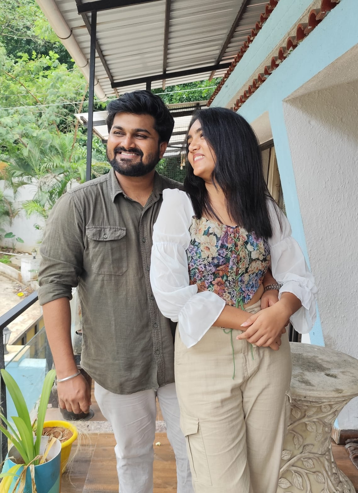
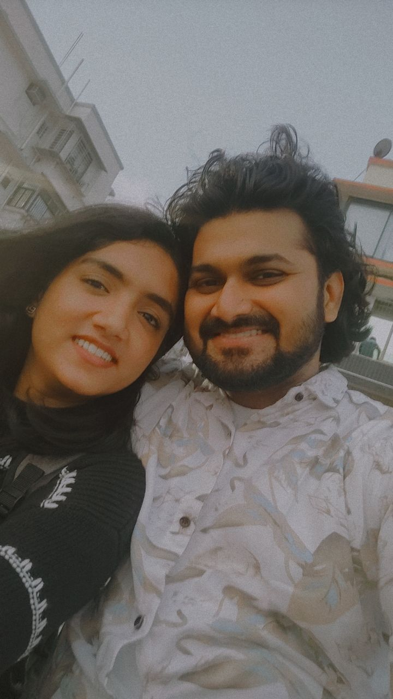

<html>
<head>

<title>Happy Birthday Shreyu ❤️</title>
<meta name="viewport" content="width=device-width, initial-scale=1.0">

</head>

<body>

<!-- PAGE 1 -->

<section class="hero" id="page1">

<h1>Shreyu ❤️</h1>

Sahil made something special for you

<button onclick="nextPage(1)">Continue</button>

</section>

<!-- PAGE 2 -->

<section class="hero hidden" id="page2">

<h1>Wait...</h1>

Are you really ready for this surprise?

<button onclick="nextPage(2)">Yes I am</button>

</section>

<!-- PAGE 3 -->

<section class="hero hidden" id="page3">

<h1>Important Question 😌</h1>

Are you ready for the surprise?

<button onclick="nextPage(3)">Yes I'm ready ❤️</button>

<button id="noBtn" onmouseover="moveButton()" style="position:absolute">
No
</button>

</section>

<!-- PAGE 4 -->

<section class="hero hidden" id="page4">

<h1>Last chance 😄</h1>

Are you REALLY ready?

<button onclick="startSite()">Show me the surprise</button>

</section>

<!-- MAIN PAGE -->

<section>

<h2>You've been my world for</h2>

</section>

<section>

<h2>Our Memories 📸</h2>

</section>

<section>

<h2>A Message For You 💌</h2>

</section>

<section>

<h2>Make a Birthday Wish 🎂</h2>

🎂

Happy Birthday Shreyu ❤️  
I love you so much.  
Thank you for being in my life.

— Sahil

</section>

<section>

<h2>One Last Thing...</h2>

<button onclick="showFinal()">Click here</button>

</section>

<!-- FINAL PAGE -->

<section class="hero hidden" id="finalPage">

<h1>Happy Birthday Shreyu ❤️</h1>

🎆 🎇 🎆 🎇

You are the most beautiful part of my life.

Love you forever.

— Sahil

</section>

<audio id="music" loop>
<source src="music.mp3" type="audio/mpeg">
</audio>

</body>
</html>
