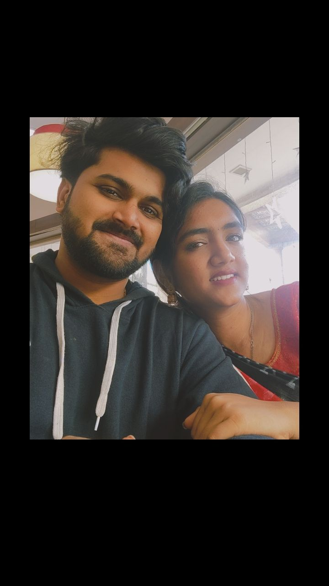
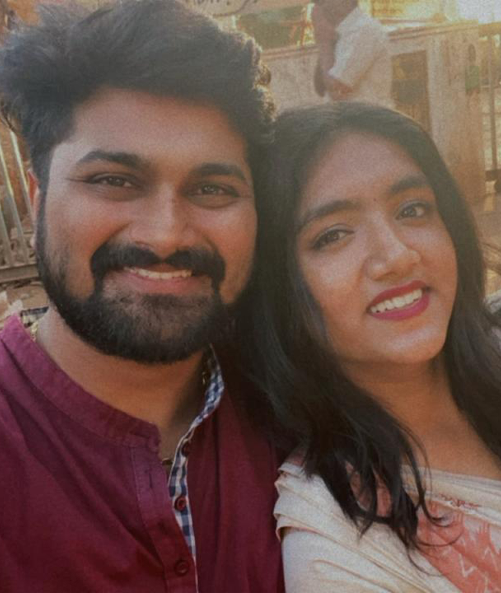
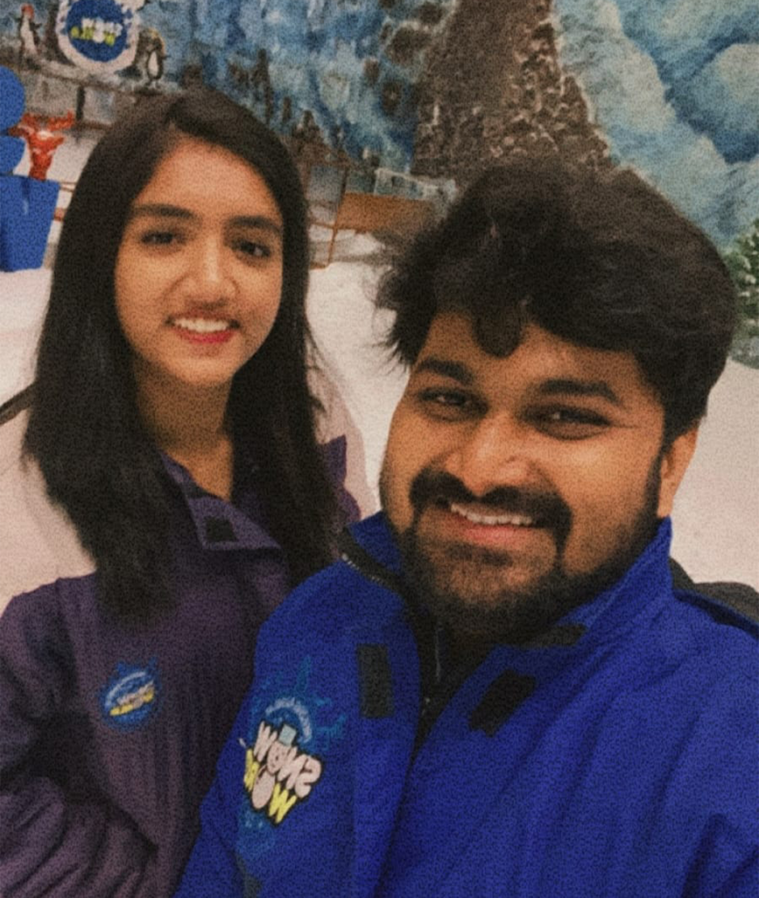
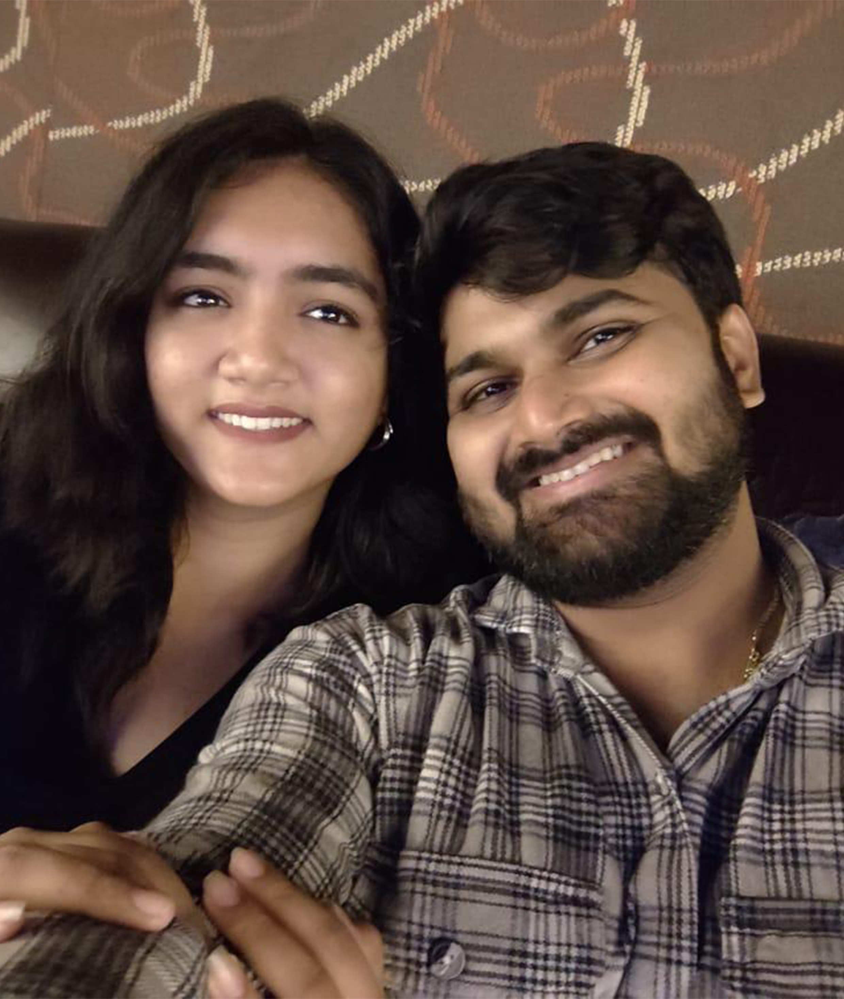

<html>
<head>

<title>Happy Birthday Shreyu ❤️</title>
<meta name="viewport" content="width=device-width, initial-scale=1.0">

</head>

<body>

<!-- loading -->

<h2>Preparing something special for Shreyu ❤️</h2>

<!-- intro pages -->

<section class="hero hidden" id="page1">
<h1 onclick="secretTap()">Shreyu ❤️</h1>

Sahil made something special for you

<button onclick="nextPage(1)">Continue</button>
</section>

<section class="hero hidden" id="page2">
<h2>Wait...</h2>

Are you really ready for this surprise?

<button onclick="nextPage(2)">Yes I am</button>
</section>

<section class="hero hidden" id="page3">
<h2>Important Question 😌</h2>

Are you ready for the surprise?

<button onclick="nextPage(3)">Yes I'm ready ❤️</button>

<button id="noBtn" onmouseover="moveButton()" style="position:absolute">
No
</button>

</section>

<section class="hero hidden" id="page4">
<h2>Last chance 😄</h2>

Are you REALLY ready?

<button onclick="startSite()">Show me the surprise</button>
</section>

<!-- main content -->

<h2>You've been my world for</h2>

<h2>Our Memories 📸</h2>

<button class="nav left" onclick="moveSlide(-1)">❮</button>

<button class="nav right" onclick="moveSlide(1)">❯</button>

<h2>Reasons I Love You ❤️</h2>

<button onclick="showReason()">What more?</button>

<h2>A Message For You 💌</h2>

<h2>Make a Birthday Wish 🎂</h2>

🎂

Happy Birthday Shreyu ❤️  
I love you so much.  
— Sahil

<button onclick="showFinal()">One Last Thing</button>

<!-- final screen -->

<section class="hero hidden" id="finalPage">

<h1>I Love You Shreyu ❤️</h1>

🎆 🎇 🎆

You make my life beautiful.

</section>

<audio id="music" loop>
<source src="music.mp3">
</audio>

</body>
</html>
